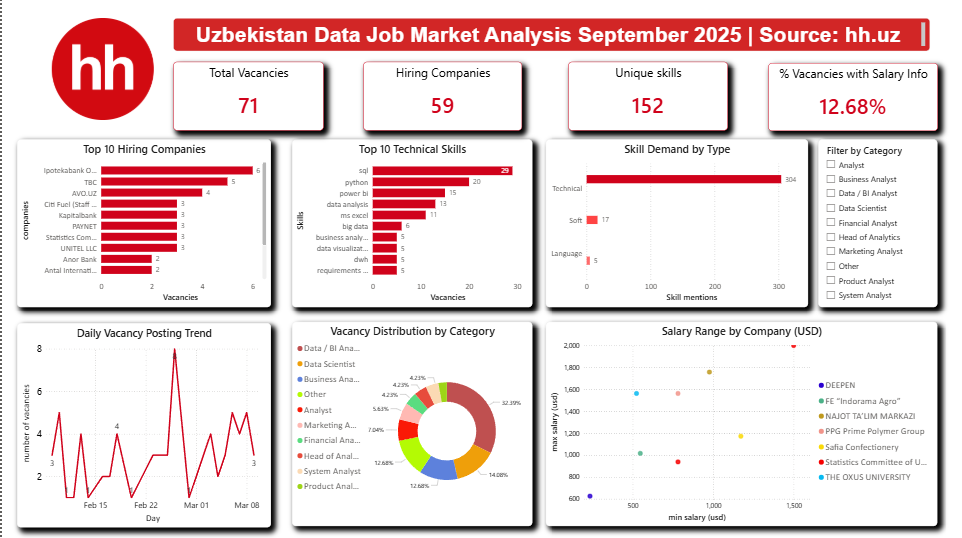

# 🔍 HeadHunter Vacancy Collector

> A production-grade ETL pipeline that collects **Data Analyst** job vacancies from [hh.uz](https://hh.uz) via REST API, cleans and normalizes the data, loads it into SQL Server, and visualizes hiring trends in a **Power BI dashboard**.

---

## 📊 Dashboard Preview



**Key Insights (September 2025):**
- 🏢 **71** active vacancies across **59** companies
- 🛠️ **SQL, Python, Power BI** are the top 3 demanded skills
- 💰 Only **12.68%** of companies disclose salary
- 🏦 **Ipotekabank OTP Group, TBC, AVO.UZ** are top hirers

---

## 🏗️ Architecture

```
┌─────────────────────────────────────────────────────┐
│                    src/main.py                       │
│              (ETL Orchestrator)                      │
└───────────┬─────────────────┬───────────────────────┘
            │                 │
     ┌──────▼──────┐   ┌──────▼──────┐
     │ collector.py│   │  cleaner.py │
     │  HH API     │   │  Transform  │
     │  + Retry    │   │  + Normalize│
     └──────┬──────┘   └──────┬──────┘
            └────────┬─────────┘
                     │
              ┌──────▼──────┐
              │  loader.py  │
              │  SQL Server │
              │  CSV Export │
              │  Power BI   │
              │  Views      │
              └─────────────┘
```

### Database Schema

```
companies ──────────────────────────┐
locations ──────────────────────────┤
                                    ▼
                               vacancies  ◄──── vacancy_skill ◄──── skills
```

---

## 🛠️ Tech Stack

| Layer | Tool |
|---|---|
| Language | Python 3.11+ |
| Data Collection | `requests` with retry + exponential backoff |
| Data Processing | `pandas`, `numpy` |
| Storage | SQL Server Express + `pyodbc`, `SQLAlchemy` |
| Config | `python-dotenv` |
| Analysis | Jupyter Notebook + `matplotlib` |
| Visualization | Power BI Desktop |

---

## 📁 Project Structure

```
HeadHunter-Vacancy-Collector/
├── src/
│   ├── main.py          # ETL pipeline entry point
│   ├── collector.py     # HH API: list + detail fetching, retry logic
│   ├── cleaner.py       # Data cleaning, normalization, skill parsing
│   ├── loader.py        # SQL Server upsert, CSV export, Power BI views
│   └── config.py        # All settings via .env
├── sql/
│   └── schema.sql       # SQL Server table definitions (idempotent)
├── docs/
│   └── dashboard_preview.png
├── analysis.ipynb       # EDA, data cleaning, visualizations
├── hh_dashboard.pbix    # Power BI dashboard file
├── .env.example         # Environment variable template
├── requirements.txt
└── README.md
```

---

## 🚀 Quick Start

### 1. Clone & set up

```bash
git clone https://github.com/ShoafzalDataAnalyst/HeadHunter-Vacancy-Collector.git
cd HeadHunter-Vacancy-Collector
python -m venv .venv
.venv\Scripts\activate        # Windows
# source .venv/bin/activate   # macOS / Linux
pip install -r requirements.txt
```

### 2. Configure environment

```bash
cp .env.example .env
# Open .env and set DB_SERVER to your SQL Server instance name
```

### 3. Create the database

Open `sql/schema.sql` in SQL Server Management Studio (SSMS) and run it. This creates all 5 tables: `companies`, `locations`, `skills`, `vacancies`, `vacancy_skill`.

### 4. Run the ETL pipeline

```bash
# Full collection:
python src/main.py

# Test mode (~30 vacancies, 3 pages) — set TEST_MODE=true in .env first
```

### 5. Open the dashboard

```
Power BI Desktop → Open → hh_dashboard.pbix
Connect: Server: localhost\SQLEXPRESS | Database: headhunter
```

---

## 📈 Power BI Views

After running the pipeline, these views are auto-created in SQL Server and ready to connect to Power BI:

| View | Description |
|---|---|
| `vw_vacancies_full` | Main fact table with USD-normalized salaries |
| `vw_skill_demand` | Skill frequency → bar/treemap charts |
| `vw_salary_by_category` | Salary range by job category |
| `vw_daily_posting_trend` | Trend line + cumulative total |
| `vw_top_hiring_companies` | Company leaderboard |
| `vw_location_heatmap` | Geographic distribution |

---

## 🗂️ Data Collected

| Column | Description |
|---|---|
| `h_id` | Unique HeadHunter vacancy ID (dedup key) |
| `title` | Full vacancy title as posted |
| `position` | Inferred role (cleaned from title) |
| `category_en` | Professional area in English |
| `publish_date` | First posting date (YYYY-MM-DD) |
| `company` | Employer name |
| `skills` | Semicolon-separated required skills |
| `skill_type` | Technical / Soft / Language |
| `location` | City / region |
| `min_salary_usd` | Minimum salary normalized to USD |
| `max_salary_usd` | Maximum salary normalized to USD |

---

## ⚙️ Key Design Decisions

- **Modular** — collector, cleaner, and loader are fully independent modules
- **Idempotent** — re-running never duplicates data (upsert by `h_id`)
- **Rate-safe** — exponential backoff on HTTP 429, configurable request delay
- **Power BI-ready** — salaries normalized to USD, skill types classified
- **Clean data** — Cyrillic company names and skills translated to English

---

## 🔧 .env Example

```env
SEARCH_TEXT=data analyst
AREA_ID=97
PER_PAGE=100
TEST_MODE=false
REQUEST_DELAY=0.2
DB_SERVER=localhost\SQLEXPRESS
DB_NAME=headhunter
DB_DRIVER=ODBC Driver 18 for SQL Server
DB_TRUSTED=yes
OUTPUT_DIR=output
LOG_LEVEL=INFO
```

---

## 📧 Contact

**Shoafzal Shomuhidov**
- GitHub: [@ShoafzalDataAnalyst](https://github.com/ShoafzalDataAnalyst)
- LinkedIn: [shoafzal-shomuhidov](https://www.linkedin.com/in/shoafzal-shomuhidov-15b647389/)
- Email: shomuhidov.shoafzal@gmail.com

---

## 📄 License

MIT — free to use, adapt, and extend.
